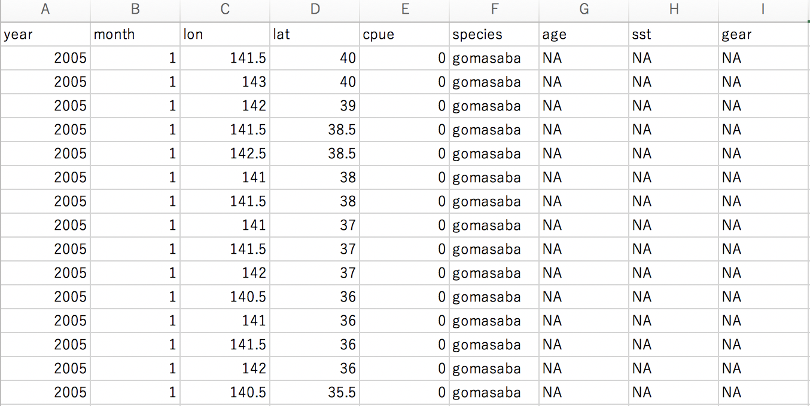

## 時空間CPUE標準化ソフトvastのワークショップ

- 日時：2/7 (金) 13:00 - 17:30 [**開始時間変更しました!!**]
- 場所：中央水産研究所 **講堂** [変更しました!!] 
- プログラム：
  - 13:00-13:10 趣旨説明
  - 13:10-13:45 cpue標準化～vastとは？
  - 13:45-17:30 VASTの基礎と応用（ハンズオン形式; 適宜休憩をはさみます）

## 持ち物
* PC
* 解析したいデータ
  * 最低限必要なのは，年，緯度経度，cpue（アバンダンス）の情報
  * 以下のようなtidy形式のデータにしてください（tidyデータとは？　https://id.fnshr.info/2017/01/09/tidy-data-intro/）
  

## 事前準備
- vastパッケージのインストール
https://github.com/James-Thorson-NOAA/VAST
  - リンク先の『Installation Instructions』を参照してください．
  - インストールが出来ない場合は，『Known instllation/ usage issues』部分も参考にしてください．
  - 上手くいかなかった場合はこのgithub上のissueに上げていただけると助かります（情報共有のため）
  - エラーの解決策もissueに載っている可能性があるので参照してください（例えば[Windows](https://github.com/ShotaNishijima/vast_workshop2020/issues/1), [Mac](https://github.com/ShotaNishijima/vast_workshop2020/issues/2)）

- テストコード
https://gist.github.com/Yuki-Kanamori/42d04d6235170f27e6d7dfce589722a2

  - 上記のリンクにテストコードがありますので、走らせていただき、動くか確認お願いします  
    **2行目のディレクトリの設定以外は，何も変更をしないで大丈夫です**
   - 最新版のFishStatsUtils（2.3.4）の場合は，156-176行目でエラーが出ますので，[こちら](https://github.com/ShotaNishijima/vast_workshop2020/issues/4)をご覧ください
   - 3.Build and run modelを実行後『The model is likely not converged』と出ますが，モデル診断で収束していると判断できる場合であっても出力されてしまうメッセージです．ちゃんと実行できている（VASTは動いている）のでご安心ください．
   - 1月14日にcppファイルが更新されたようです（8.5.0）．コンパイルがうまくいかない場合は，一つ前のバージョン（8.4.0）を指定したりと試行錯誤が必要になります．バージョンの指定方法などは[issues](https://github.com/ShotaNishijima/vast_workshop2020/issues) を参考にしてください．
   - cppファイルの更新に伴い，FishStatuUtilsのバージョンも新しく2.5.0になったようです．現在描画で出てくる不具合は，そのことが原因だと思われます．
   どこでどんなエラー・ワーニングが出るのか，こちらでも情報を集めている段階です．
   

## 参考資料    
### **論文・ドキュメント**
* VAST全般について（モデルの説明，適用例，課題など）    
  Thorson JT (2019) Guidance for decisions using the Vector Autoregressive Spatio-Temporal (VAST) package in stock, ecosystem, habitat and climate assessments. Fish Res 210:143–161    
  https://doi.org/10.1016/j.fishres.2018.10.013
* マサバの産卵量に適用した例    
  Kanamori Y, Takasuka A, Nishijima S, Okamura H (2019) Climate change shifts the spawning ground northward and extends the spawning period of chub mackerel in the western North Pacific. MEPS 624:155–166    
  https://doi.org/10.3354/meps13037    
* 国内の資源評価で適用された例（和文で解説が書かれている）    
  [令和元 (2019) 年度ゴマサバ太平洋系群の資源評価　補足資料3](http://www.fra.affrc.go.jp/shigen_hyoka/SCmeeting/2019-1/detail_goma_p_2.pdf)
### **マニュアル**
* 4.figuresで出てくる図表についての説明も書かれている．モデル診断についても書いてある    
  [single species](single-species.pdf)    
  [multi species](multi-species.pdf)
* 1.4 model settingsの参考になる    
  [vast model structure](VAST_model_structure.pdf) 最新のオプションについても書かれている    
  [user manual](VAST_user_manual.pdf) 昔のシンプルな設定のやつ
### **描画パッケージ**
ggvast https://github.com/Yuki-Kanamori/ggvast    
* VASTの推定結果を`Save.RData`から引っ張り出せる
* 軸の名前とかが変えられる
### **vastのコード**
* 複数のカテゴリーでの解析（[part3_multisp](https://github.com/ShotaNishijima/vast_workshop2020/tree/master/ws用のスクリプトとデータ), masaVAST;準備中）
* catchability covariateを入れた解析（[part3_catchability](https://github.com/ShotaNishijima/vast_workshop2020/tree/master/ws用のスクリプトとデータ), [gomasaVAST](https://github.com/Yuki-Kanamori/gomasaVAST)）
* overdispersionを入れた解析（[part3_overdispersion](https://github.com/ShotaNishijima/vast_workshop2020/tree/master/ws用のスクリプトとデータ), [gomasaVAST](https://github.com/Yuki-Kanamori/gomasaVAST)）
* 共変量を入れた例（masaVAST_NPFC2018;準備中）
### **アップデート情報**    
https://github.com/James-Thorson-NOAA/VAST/releases
